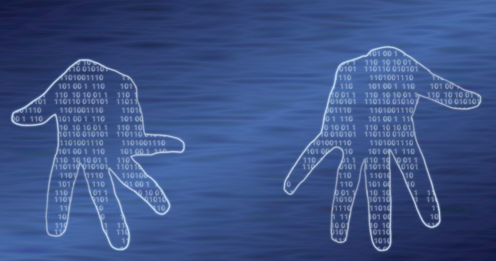

# Understanding Digital Identity: What it is and why it is important

## What is Digital Identity?

**Digital identity** refers to the **information** that we share or that is available about us on the internet or in digital spaces. This includes **personal information** such as our name, age, address, and other details that we might share online. It also includes the **things we post** or share online, including photos, videos, comments, and opinions.

## Positive and negative impacts

Digital identity can have both **positive and negative impacts** on our lives. It can **help us** to connect with others, express ourselves, and share our interests and passions. However, it can also **put us at risk** of cyberbullying, identity theft, and other online dangers.

It's important to **be aware of our digital identity** and take steps to protect it. This includes being careful about what we share online, using strong passwords and security settings, and being mindful of our online behavior and interactions with others.

## Video: What is Digital Identity?

<iframe width="560" height="315" src="https://www.youtube.com/embed/OGV5OBa938I" title="YouTube video player" frameborder="0" allow="accelerometer; autoplay; clipboard-write; encrypted-media; gyroscope; picture-in-picture; web-share" allowfullscreen></iframe>

### Video transcription

**What is digital identity?**

A digital identity is the compilation of information about you that exists online. Your digital identity includes anything online that is associated with your name, such as social media posts, interactions, articles, publications, institutional affiliations, and more. 

Our digital identities are created by how we present ourselves, and how we are seen by others, in both personal and professional settings.

But why is understanding digital identity important? 

Who we are online gives others insight into who we are in real life. This leads us to make assumptions about people even if we have never met them in person. 

How do we create a digital identity?

**Step 1: Google Yourself**

The first step to creating your digital identity is to realize that if you engage online you likely already have one. Take inventory of how you appear online by Googling yourself, or looking at past social media posts and interactions. 

[A graphic of a search engine appears with the words “Who am I?” typed into the search bar.]

Ask yourself: 
Does this digital image represent who I am right now? 
Are these profiles active, and do I want to change them?
Why do I want to use this social account, and
What are my goals for my digital identity?

**Step 2: Set goals**

The next step to creating your digital identity is to understand your goals. Do you want your digital identity to represent your professional aspirations, or your personal and social aims? Someone marketing themselves as an academic or business professional may have different goals and a different digital identity than a comedian, an artist, or a teacher. 

Do all your social accounts align with the same goal and persona? What are future employers seeing when they google your name? Think about whether your online presence is hindering any personal or professional aims. Decide on a goal and stay consistent across your platforms. 

**Step 3: Be authentic**

Your digital identity should ultimately reflect who you are offline, whether this is your personal or professional life. Being authentic will help you maintain a consistent image across platforms. 

[An animated man appears on screen holding his phone. Beside him is an enlarged phone screen containing his social media profiles. He appears the same in both.]

Are digital identities always authentic?

While authenticity is important, what we see online does not always reflect how a person is in the real world. Keep in mind that a digital identity is a curated image of a person that does not always reflect their whole self. The online world can even contain false identities that differ drastically from who the people behind them really are. 

[The woman's social media account is displayed on screen. An X appears to show that her identity is false and an arrow points to a different figure that represents her true identity.]

Our digital identity can affect the interactions, opportunities, and reputation we have in the real world. When creating your digital identity, it is important to take inventory of your online past, define your goals, and present yourself authentically across all platforms.

## Glossary with examples

| English | Spanish | Example sentence |
| ------- | ------- | ------- |
| Address | Dirección | Make sure to keep your address private when sharing information online. |
| Age | Edad | It's important to confirm your age when setting up an account on a social media platform. |
| Aliases | Alias | Using aliases online can provide a layer of anonymity, but it can also make it harder to establish a digital identity. |
| Avatars | Avatares | Some people choose to use avatars as their online identity to protect their privacy. |
| Aware | Consciente | Being aware of your online presence can help protect your digital identity. |
| Behaviors | Comportamientos | Your online behaviors can impact your digital reputation and identity. |
| Behavior | Comportamiento | Positive online behavior can enhance your digital identity. |
| Careful | Cuidadoso | It's important to be careful when sharing personal information online to protect your digital identity. |
| Comments | Comentarios | Negative comments on social media can harm your digital reputation and identity. |
| Connect | Conectar | Social media platforms make it easy to connect with others and establish a digital identity. |
| Construction | Construcción | The construction of a digital identity can be a deliberate process or can happen organically through online activity. |
| Cyberbullying | Ciberacoso | Cyberbullying can have a serious impact on someone's digital identity and mental health. |
| Dangers | Peligros | There are many potential dangers to consider when sharing personal information online, including identity theft. |
| Digital footprint | Huella digital | Your digital footprint is the trail of data you leave behind through online activity, and it can impact your digital identity. |
| Digital Identity | Identidad Digital | A digital identity is the persona someone creates for themselves through online activity and presence. |
| Express | Expresar | Social media platforms provide a space for people to express themselves and establish their digital identity. |
| External | Externo | External factors, such as how others perceive you online, can also impact your digital identity. |
| Impacts | Impactos | Your online activity can have both positive and negative impacts on your digital identity. |
| Influential | Influyente | Social media influencers have a significant impact on digital identity and can shape trends and online behaviors. |
| Interactions | Interacciones | Positive online interactions can enhance your digital identity and reputation. |
| Interests | Intereses | Sharing interests and hobbies online can help establish a digital identity and connect with others. |
| Lives | Vidas | Social media provides a glimpse into the lives of others and can shape someone's digital identity. |
| Mindful | Consciente | Being mindful of what you share online can protect your digital identity and reputation. |
| Name | Nombre | Using your real name online can help establish a consistent digital identity. |
| Negative | Negativo | Negative online activity can harm your digital identity and reputation. |
| Online | En línea | Online activity and presence contribute to someone's digital identity. |
| Opinions | Opiniones | Sharing opinions and viewpoints online can help establish a digital identity, but it can also lead to conflict. |
| Passions | Pasiones | Sharing passions and interests online can help establish a unique digital identity. |
| Passwords | Contraseñas | Using strong passwords is essential for protecting your digital identity and online accounts. |
| Personal exposure | Exposición personal | Personal exposure online can impact someone's digital identity and reputation. |
| Personal Information | Información Personal | Protecting personal information online is crucial for safeguarding digital identity. |
| Perception | Percepción | How others perceive you online can impact your digital identity and reputation. |
| English | Spanish | Example Sentence |
| ------- | ------- | ------- |
| Photos | Fotos | I deleted all the photos from my digital identity that showed me drinking alcohol. |
| Positive | Positivo | His positive online reputation has helped him get job offers. |
| Post | Publicación | I made a post on social media about my new job, but I didn't share my workplace's address for privacy reasons. |
| Privacy | Privacidad | It's important to check the privacy settings on your social media accounts to control who can see your personal information. |
| Protect | Proteger | You can protect your digital identity by using strong passwords and avoiding suspicious emails. |
| References | Referencias | The hiring manager asked for references, so I provided a few colleagues' email addresses who could speak to my work experience. |
| Risk | Riesgo | Posting personal information online can put you at risk for identity theft. |
| Security | Seguridad | The website uses encryption technology to ensure the security of users' personal information. |
| Self-concept | Autoconcepto | Social media can have a negative impact on self-concept, as people tend to present only the best versions of themselves online. |
| Share | Compartir | Before you share a photo of your friend online, make sure you have their permission first. |
| Sociocultural | Sociocultural | Our sociocultural background can influence our digital behavior, such as how much personal information we feel comfortable sharing online. |
| Settings | Configuraciones | Adjusting the privacy settings on your social media accounts can help you control who sees your personal information. |
| Steps | Pasos | These are the steps you should take if you think your digital identity has been compromised. |
| Videos | Videos | She made a video talking about her experience with cyberbullying to raise awareness about the issue. |
| Web | Web | The internet has made it easier than ever to build and manage our digital identities. |