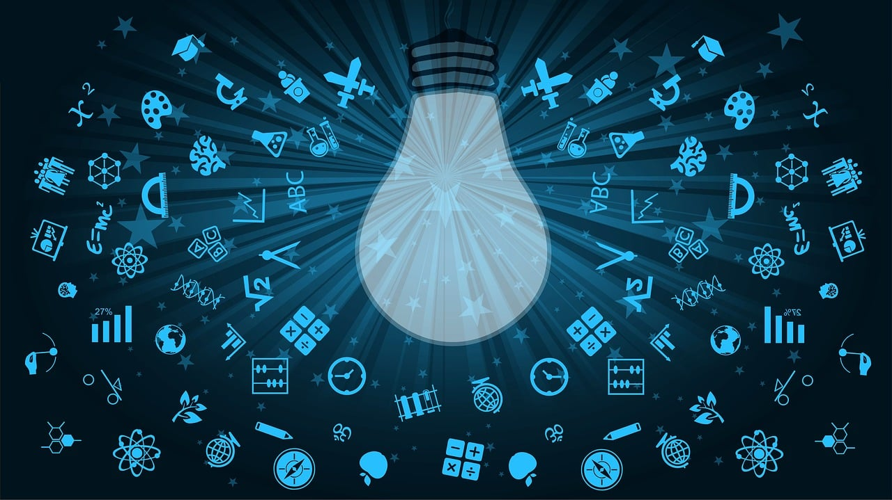

# Digital Identity

## We are learning...

1. **Understanding Digital Identity: What it is and why it is important.** In this section, you'll learn what digital identity means and why it matters in today's digital age. You'll explore the different aspects of digital identity, including personal information, online behaviors, and social interactions, and understand how they contribute to your overall digital identity.

2. **Creating Online Personas: Choosing Usernames and Avatars.** This section will focus on creating online personas and how to choose appropriate usernames and avatars. You'll learn how to create an online identity that aligns with your personal and professional goals and how to manage multiple personas if necessary.

3. **How We See Ourselves and Others See Us Online: Self-image and Perception.** In this section, you'll explore how digital identity can affect our self-image and how others perceive us online. You'll learn how to manage your online image, build a positive reputation, and respond to online feedback.

4. **People Who Influence Our Digital Identity**. This section will cover the different types of people who can influence our digital identity, including friends, family, colleagues, and strangers. You'll learn how to manage online interactions with each of these groups and how to respond to negative feedback or cyberbullying.

5. **Leaving Our Mark Online: Digital Footprints and Online Reputation.** In this section, you'll learn about digital footprints and how they impact your online reputation. You'll explore the different types of online content that can contribute to your digital footprint, such as social media posts, blog articles, and online comments, and learn how to manage your online presence.

6. **Being a Responsible Digital Citizen.** This section will focus on the importance of being a responsible digital citizen. You'll learn about online ethics, netiquette, and digital citizenship, and understand how to participate in online communities in a respectful and productive manner.

7. **Staying Safe Online: Protecting Our Personal Information and Privacy.** In this section, you'll learn how to protect your personal information and privacy online. You'll explore different ways that hackers and cybercriminals can steal your data, such as phishing scams and malware, and learn how to use security measures like strong passwords, firewalls, and two-factor authentication to keep your information safe.