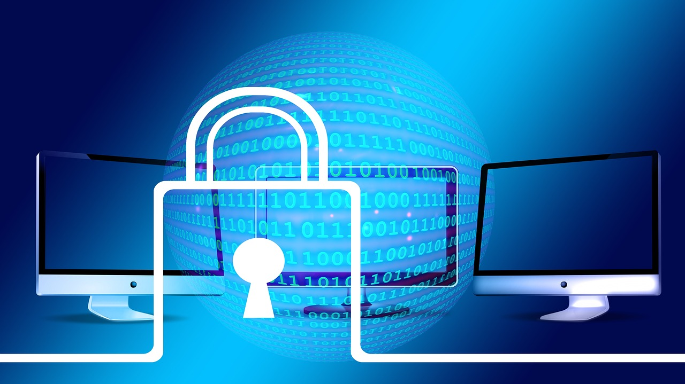
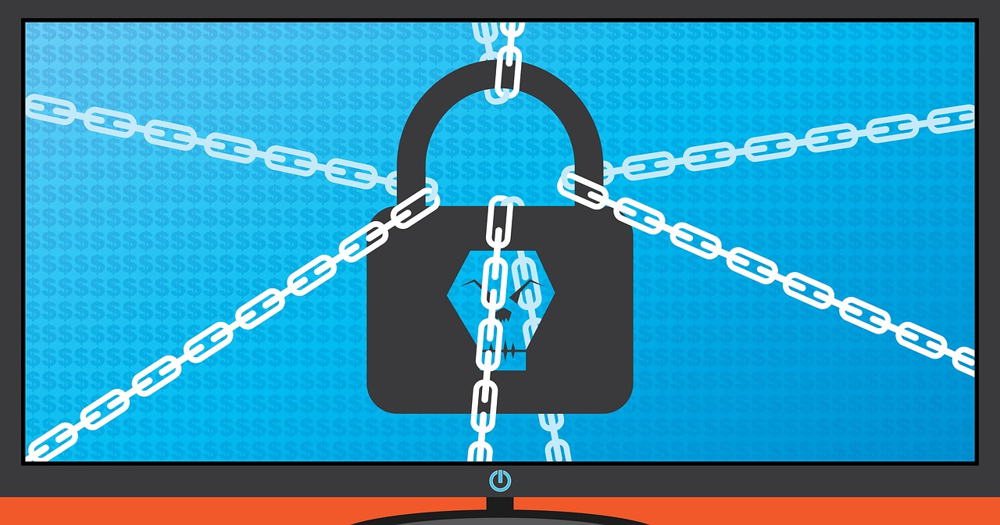
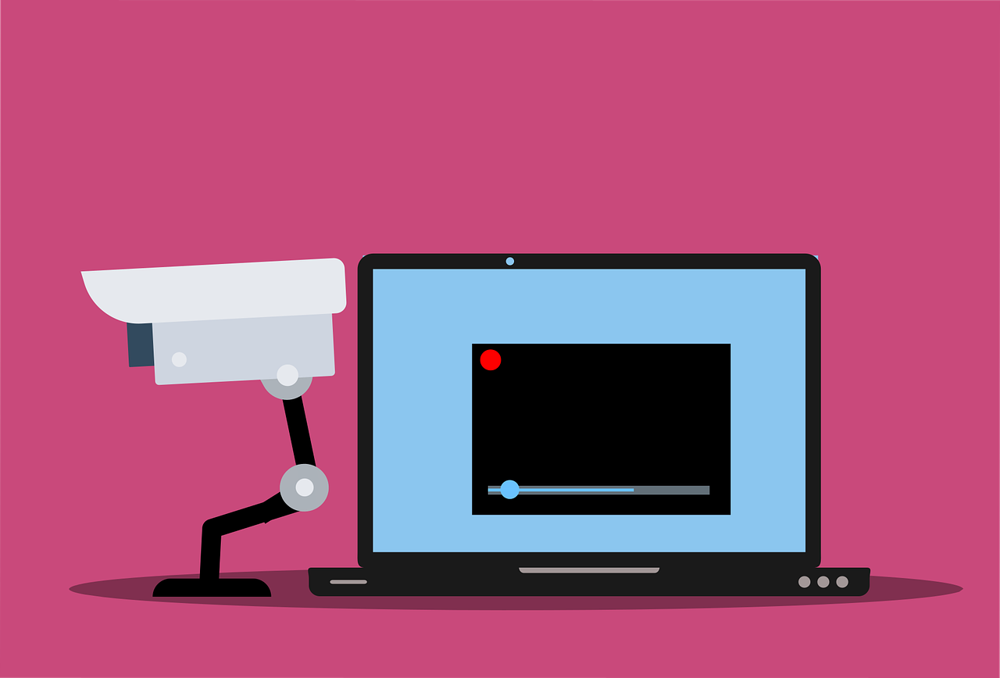

# IT Threats

Risks and threats of device use and network relationships. Cyberbullying and fraud.

## Botnets

**What they are**

A collection of software robots, or 'bots', that creates an army of infected computers (known as ‘zombies') that are remotely controlled by the originator. Yours may be one of them and you may not even know it.

A botnet[^botnet] is a group of computers that have been infected with harmful software. This allows someone else to control the computers from a remote location without the owners knowing. The person controlling the botnet can use these computers to do bad things, like spread viruses or attack other websites. It's important to protect your computer from becoming part of a botnet by keeping your antivirus software up to date and being careful about what you download or click on.

**What they can do**

- Send spam emails with viruses attached.
- Spread all types of malware.
- Can use your computer as part of a denial of service attack against other systems.

Hacking[^hackingimg]

## Hacking

**What it is**

The process by which cyber criminals gain unauthorized access to a computer. The availability of information online on the tools, techniques, and malware makes it easier for even non-technical people to undertake malicious activities.

**What it can do**

- Find weaknesses (or pre-existing bugs) in your security settings and exploit them in order to access your information.
- Install a Trojan horse, providing a back door for hackers to enter and search for your information.

Malware[^malwareimg]

## Malware

**What it is**

Malware is one of the more common ways to infiltrate or damage your computer. It is a malicious software that infects your computer, such as computer viruses, worms, Trojan horses, spyware, and adware.

**What it can do**

- Intimidate you with scareware, which is usually a pop-up message that tells you your computer has a security problem or other false information.
- Reformat the hard drive of your computer causing you to lose all your information.
- Alter or delete files.
- Steal sensitive information.
- Send emails on your behalf.
- Take control of your computer and all the software running on it.

Pharming[^pharmingimg]

## Pharming

**What is is**

Pharming is a common type of online fraud that points you to a malicious and illegitimate website by redirecting the legitimate URL. Even if the URL is entered correctly, it can still be redirected to a fake website.

**What it can do**

Convince you that the site is real and legitimate by spoofing or looking almost identical to the actual site down to the smallest details. You may enter your personal information and unknowingly give it to someone with malicious intent.

Phishing[^phishingimg]

## Phishing

**What it is**

Fake emails, text messages and websites created to look like they're from authentic companies. They're sent by criminals to steal personal and financial information from you. This is also known as “spoofing”.

**What it does**

- Trick you into giving them information by asking you to update, validate or confirm your account. It is often presented in a manner than seems official and intimidating
- Provides cyber criminals with your username and passwords so that they can access your accounts (online bank account, shopping accounts, etc.) and steal your credit card numbers.

<iframe width="560" height="315" src="https://www.youtube.com/embed/W2tZEFUCjTs" title="YouTube video player" frameborder="0" allow="accelerometer; autoplay; clipboard-write; encrypted-media; gyroscope; picture-in-picture; web-share" allowfullscreen></iframe>

[Video: Phishing](https://youtu.be/W2tZEFUCjTs)

Ransomware[^ransomwareimg]

## Ransomware

**What it is**

Ransomware is a type of malware that restricts access to your computer or your files and displays a message that demands payment in order for the restriction to be removed.

There are two common types of ransomware:
- Lockscreen ransomware: displays an image that prevents you from accessing your computer
- Encryption ransomware: encrypts files on your system’s drives, and even some cloud storage drives, preventing you from opening them.

SPAM[^spamimg]

## SPAM

**What it is**

The mass distribution of unsolicited messages or advertising to addresses which can be easily found on the Internet through things like social networking sites, company websites and personal blogs.

**What it can do**

- Annoy you with unwanted junk mail.
- Create a burden for communications service providers and businesses to filter electronic
messages.
- Phish for your information by tricking you into following links or entering details with too-goodto-be-true offers and promotions.
- Provide a vehicle for malware, scams, fraud and threats to your privacy.

Spoofing[^spoofingimg]

## Spoofing

**What it is**

A website or email address that is created to look like it comes from a legitimate source. An email address may even include your own name, or the name of someone you know, making it difficult to discern whether or not the sender is real.

**What it does**

- Spends spam using your email address, or a variation of your email address, to your contact list.
- Recreates websites that closely resemble the authentic site. This could be a financial institution or other site that requires login or other personal information.

Spyware[^spywareimg]

## Spyware

**What it is**

Software that collects personal information about you without you knowing. They often come in the form of a ‘free' download and are installed automatically with or without your consent. These are difficult to remove and can infect your computer with viruses.

**What it can do**

- Collect information about you without you knowing about it and give it to third parties.
- Send your usernames, passwords, surfing habits, list of applications you've downloaded, settings, etc. to third parties.
- Change the way your computer runs without your knowledge.
- Take you to unwanted sites or inundate you with uncontrollable pop-up ads.

Trojan Horse[^trojanhorseimg]

## Trojan horse

**What it is**

A malicious program that is disguised as, or embedded within, legitimate software. It is an executable file that will install itself and run automatically once it's downloaded

**What it can do**

- Delete your files.
- Use your computer to hack other computers.
- Watch you through your web cam.
- Log your keystrokes (such as a credit card number you entered in an online purchase).
- Record usernames, passwords and other personal information.

Viruses[^virusesimg]

## Viruses

**What they are**

Malicious computer programs that are often sent as an email attachment or a download with the intent of infecting your computer, as well as the computers of everyone in your contact list. Just visiting a site can start an automatic download of a virus.

**What they can do**

- Send spam.
- Provide criminals with access to your computer and contact lists.
- Scan and find personal information like passwords on your computer.
- Hijack your web browser.
- Disable your security settings.
- Display unwanted ads.

WiFi[^wifiimg]

## Wi-Fi Eavesdropping

**What it is**

Virtual “listening in” on information that's shared over an unsecure (not encrypted) WiFi network. WiFi eavesdropping is another method used by cyber criminals to capture personal information.

**What it can do**

- Potentially access your computer with the right
equipment.
- Steal your personal information including logins and passwords.

Worms[^wormsimg]

## Worms

**What they are**

A worm, unlike a virus, goes to work on its own without attaching itself to files or programs. It lives in your computer memory, doesn't damage or alter the hard drive and propagates by sending itself to other computers in a network – whether within a company or the Internet itself.

**What they can do**

- Spread to everyone in your contact list.
- Cause a tremendous amount of damage by shutting down parts of the Internet, wreaking havoc on an internal network and costing companies enormous amounts of lost revenue.

# Webgraphy & Images

[^botnet]: [*¿Qué es un botnet?*](https://www.kaspersky.es/blog/que-es-un-botnet/755/)

[^hackingimg]: [Image: Hacking](https://pixabay.com/photos/computer-security-padlock-hacker-1591018/)
[^malwareimg]: [Image: Malware](https://pixabay.com/photos/computer-virus-hacker-4282377/)
[^pharmingimg]: [Image: Pharming](https://pixabay.com/photos/security-binary-binary-code-castle-2688911/)
[^phishingimg]: [Image: Phishing](https://pixabay.com/vectors/phishing-credentials-data-login-6573326/)
[^ransomwareimg]: [Image: Ransomware](https://pixabay.com/photos/ransomware-cybersecurity-cyber-3998798/)
[^spamimg]: [Image: SPAM](https://pixabay.com/photos/keyboard-hands-write-input-e-mail-3689236/)
[^spoofingimg]: [Image: Spoofing](https://pixabay.com/photos/cyber-security-global-network-2296269/)
[^spywareimg]: [Image: Spyware](https://pixabay.com/vectors/cctv-camera-security-webcam-6078897/)
[^trojanhorseimg]: [Image: Trojan Horse](https://pixabay.com/vectors/horse-wood-toy-konik-trojan-horse-3108969/)
[^virusesimg]: [Image: Viruses](https://pixabay.com/vectors/bug-antivirus-laptop-virus-alert-6844832/)
[^wifiimg]: [Image: WiFi](https://pixabay.com/photos/computer-business-wifi-information-3596169/)
[^wormsimg]: [Image: Worms](https://pixabay.com/illustrations/laptop-security-virus-protection-4152330/)