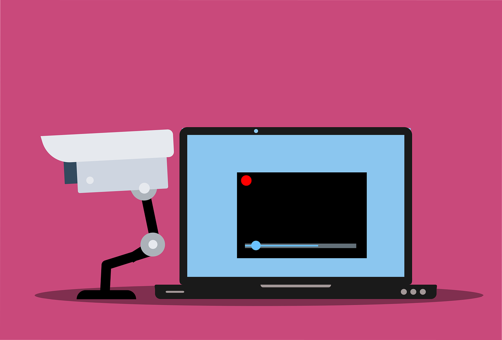

Spyware[^spywareimg]

## Spyware

**What it is**

Software that collects personal information about you without you knowing. They often come in the form of a ‘free' download and are installed automatically with or without your consent. These are difficult to remove and can infect your computer with viruses.

**What it can do**

- Collect information about you without you knowing about it and give it to third parties.
- Send your usernames, passwords, surfing habits, list of applications you've downloaded, settings, etc. to third parties.
- Change the way your computer runs without your knowledge.
- Take you to unwanted sites or inundate you with uncontrollable pop-up ads.

[^spywareimg]: [Image: Spyware](https://pixabay.com/vectors/cctv-camera-security-webcam-6078897/)