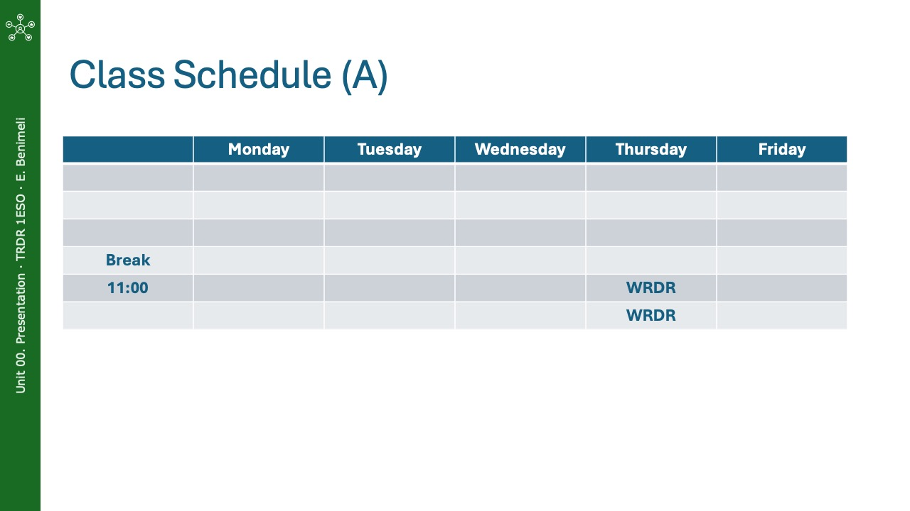

# Class 00. Course Presentation

**Table of contents**

[TOC]

## Work Plan

In this first class, the course is introduced, including its objectives, methodology, and assessment criteria. In addition, the basic concepts of programming are introduced, and the course expectations are discussed.

## Slides

  
  
  
  
  
  
  
  

