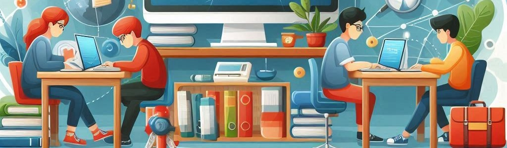

# Unit 1: Digital Devices, Operating Systems, and Computer Networks

## Summary

This unit covers the use and understanding of personal computers, mobile devices, and other digital devices in both home and educational settings. Students will learn about the basic functioning and features of these devices, as well as common operating systems and applications. 

## Learning Objectives

| Ref. | Definition                           | CE |
| :--- | :----------------------------------- | :--- | 
| 1.1 | Identify basic characteristics of digital devices  for personal use in domestic and educational settings. | CE1 | 
| 1.2 | Determine which device and internet access mode  is the most suitable for the needs. | CE1 | 
| 1.3 | Connect digital devices to the internet securely. | CE1 | 
| 1.4 | Recognize the implications of technology use and consumption on health and the environment. | CE1 | 
| 1.5 | Show basic security habits to protect devices. | CE1 | 