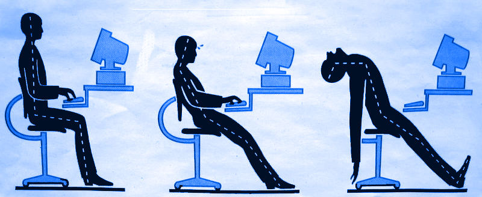

# Digital Devices and Health

## Introduction

**Digital device use** can lead to eye strain, headaches, and back pain due to poor posture and prolonged screen exposure. To prevent discomfort, adjust screen height, reduce glare, and take regular breaks. Blinking often helps avoid dry eyes.

Headaches are common due to close screen proximity and can be alleviated by stretching and maintaining good posture. Back pain can be reduced by practicing dynamic sitting, adjusting backrests, and using lumbar support.

**Ergonomics** plays a crucial role in optimizing equipment design to enhance comfort and efficiency, reducing strain and promoting overall health in work and living spaces.

### How digital devices affect our bodies

Using digital devices affects our bodies. Here are some common effects:

- **Eye Strain**: When we look at screens for a long time, our eyes can become tired. This is called "eye strain." It can make our eyes hurt, feel dry, or blurry. To avoid this, remember the "20-20-20 rule": every 20 minutes, look at something 20 feet away for 20 seconds.

- **Sleep Problems**: The light from screens (especially at night) can make it hard for us to sleep. Our brains need darkness to know when it’s time to rest. Avoid using screens at least one hour before bed to help your brain relax.

- **Bad Posture**: When we use devices for too long, we may hunch over, which is bad for our neck and back. Try to sit up straight and take breaks to move around.

- **Less Physical Activity**: Spending too much time on screens means less time being active, which is important for staying healthy. Balance screen time with physical activities, like playing outside or doing sports.

Digital devices cause eye strain, sleep issues, poor posture, and less physical activity. Take breaks, limit screen use, and stay active.

## Risks and Tips

### Eyestrain

Computer users may experience symptoms such as blurred vision, temporary inability to focus on faraway objects and headaches.

- Computer screen - Adjust the height of your screen so you're not tilting your head down and tensing your neck.
- Lighting - Try adjusting the screen and the lights to keep glare to a minimum.
- Rest breaks - Taking periodic breaks, during which you relax and gently stretch your neck muscles, can ease muscle strain. 
- Remembering to blink can help you avoid dry eyes

Adjust screen height, reduce glare, take breaks, and blink regularly to <b>prevent eye strain</b>, headaches, and muscle tension for computer users.

### Headache

A computer screen is much like a television but you sit much closer to it. The light coming from the monitor can cause eyestrain if you stare at it for too long. This and also other reasons when working at a computer, including stress and poor posture can lead to a headache.

Regular breaks can help reduce muscle strain and alleviate these problems.

Sitting close to screens causes eyestrain and headaches; poor posture adds to the issue. Regular breaks reduce muscle strain and discomfort.

### Backpain

While working at the computer, back pain is one of the most common workplace problems.

- Practice «dynamic sitting»: be flexible and move while sit, don’t just stay in one static posture.
- Adjust the backrest so you are sitting at a 90 degree angle.
- Adjust the lumbar support to fit your low back's natural inward curve.
- Adjust the height of the backrest to support the natural inward curvature of the lower back. Use your armrests.

To <b>prevent back pain</b> while working, practice dynamic sitting, adjust backrests and lumbar support, and use armrests for comfort.

## Ergonomics

### What is ergonomics?

Ergonomics is the scientific study focused on optimizing the design of equipment, tools, and workspaces to enhance efficiency, comfort, and safety.

It involves understanding human anatomy, behavior, and limitations to create environments and products that align with the body's natural movements and capabilities.

The scientific study of equipment design, as in office furniture or transportation seating, for the purpose of improving efficiency, comfort, or safety.

For instance, in office settings, ergonomic principles guide the design of chairs, desks, and computer setups to reduce strain on the neck, back, and wrists, thereby preventing repetitive stress injuries and promoting good posture. Similarly, in transportation, ergonomic seating aims to provide both comfort and safety, reducing fatigue during long journeys.

By considering factors like body posture, movement, and the reduction of physical strain, ergonomics not only improves productivity but also enhances overall well-being.

**Work safely in your office**

<iframe width="560" height="315" src="https://www.youtube.com/embed/cYVBVx-dX6k?si=DNxUZGLNt7unP8l9" title="YouTube video player" frameborder="0" allow="accelerometer; autoplay; clipboard-write; encrypted-media; gyroscope; picture-in-picture; web-share" referrerpolicy="strict-origin-when-cross-origin" allowfullscreen></iframe>

This field draws on knowledge from disciplines such as biomechanics, psychology, and engineering to create user-friendly solutions that cater to the needs of diverse populations, ultimately contributing to healthier and more sustainable work and living environments.

---

### Activity

### Ergonomics: Office, Laptop and Smartphones

**Laptop Ergonomics - Basic Tips**

<iframe width="560" height="315" src="https://www.youtube.com/embed/ZLwIP8cBaWA?si=d6l5aKeKlfCQI9g0" title="YouTube video player" frameborder="0" allow="accelerometer; autoplay; clipboard-write; encrypted-media; gyroscope; picture-in-picture; web-share" referrerpolicy="strict-origin-when-cross-origin" allowfullscreen></iframe>

 

** Ergonomics: Smartphones & Tablets**

<iframe width="560" height="315" src="https://www.youtube.com/embed/_DEmtz7TU6o?si=WI6-vELMYK9TpOk3" title="YouTube video player" frameborder="0" allow="accelerometer; autoplay; clipboard-write; encrypted-media; gyroscope; picture-in-picture; web-share" referrerpolicy="strict-origin-when-cross-origin" allowfullscreen></iframe>

 

**Computing Health and Safety**

<iframe width="560" height="315" src="https://www.youtube.com/embed/T8qGO7XQ0Uw?si=vjJ6BhdTDTAEYon3" title="YouTube video player" frameborder="0" allow="accelerometer; autoplay; clipboard-write; encrypted-media; gyroscope; picture-in-picture; web-share" referrerpolicy="strict-origin-when-cross-origin" allowfullscreen></iframe>

 

## Glossary

| English              | Spanish                    | Example (Inglés)                                         |
|----------------------|----------------------------|----------------------------------------------------------|
| Active               | *Activo*                   | Stay **active** to counteract screen time.               |
| Alleviate            | *Aliviar*                  | Breaks **alleviate** muscle strain.                      |
| Anatomy              | *Anatomía*                 | **Anatomy** plays a role in ergonomic design.            |
| Armrests             | *Reposabrazos*             | Adjust the **armrests** for comfort.                     |
| Back pain            | *Dolor de espalda*         | Proper posture reduces **back pain**.                    |
| Balance              | *Equilibrar*               | **Balance** screen time with exercise.                   |
| Bedtime              | *Hora de dormir*           | Avoid screens near **bedtime**.                          |
| Behavior             | *Comportamiento*           | Digital **behavior** affects health.                     |
| Blinking             | *Parpadeo*                 | Remember to **blink** regularly.                         |
| Body posture         | *Postura corporal*         | Correct **body posture** prevents pain.                  |
| Chair                | *Silla*                    | Use an ergonomic **chair** for comfort.                  |
| Comfort              | *Comodidad*                | Ergonomics improve **comfort** and safety.               |
| Computer setup       | *Configuración del ordenador* | Adjust the **computer setup** for better posture.      |
| Darkness             | *Oscuridad*                | **Darkness** helps the brain relax at night.             |
| Desk                 | *Escritorio*               | Keep your **desk** organized and ergonomic.              |
| Digital device       | *Dispositivo digital*      | **Digital devices** impact eye health.                   |
| Discomfort           | *Incomodidad*              | **Discomfort** arises from poor posture.                 |
| Efficiency           | *Eficiencia*               | **Efficiency** is increased with ergonomic practices.    |
| Equipment design     | *Diseño de equipos*        | **Equipment design** affects comfort.                    |
| Ergonomics           | *Ergonomía*                | **Ergonomics** improves workplace health.                |
| Eyes                 | *Ojos*                     | Staring at screens strains your **eyes**.                |
| Eye strain           | *Fatiga visual*            | **Eye strain** occurs with prolonged screen use.         |
| Fatigue              | *Fatiga*                   | **Fatigue** is common from extended screen exposure.     |
| Flexibility          | *Flexibilidad*             | **Flexibility** in sitting reduces pain.                 |
| Glare                | *Deslumbramiento*          | Reduce **glare** for better visibility.                  |
| Headache             | *Dolor de cabeza*          | **Headaches** may follow long screen exposure.           |
| Hunch over           | *Encogerse*                | Avoid **hunching over** while using devices.             |
| Inward curve         | *Curvatura interna*        | Adjust lumbar support for **inward curve** of the back.  |
| Lighting             | *Iluminación*              | Proper **lighting** reduces glare.                       |
| Lumbar support       | *Soporte lumbar*           | **Lumbar support** helps avoid back pain.                |
| Monitor              | *Monitor*                  | Adjust your **monitor** height for comfort.              |
| Move around          | *Moverse*                  | **Move around** to prevent muscle strain.                |
| Muscle strain        | *Tensión muscular*         | Take breaks to prevent **muscle strain**.                |
| Neck                 | *Cuello*                   | **Neck** pain can result from poor posture.              |
| Physical activity    | *Actividad física*         | **Physical activity** balances screen time.              |
| Posture              | *Postura*                  | Good **posture** prevents digital strain.                |
| Productivity         | *Productividad*            | **Productivity** is boosted by ergonomic designs.        |
| Relax                | *Relajarse*                | **Relax** your eyes after screen use.                    |
| Rest break           | *Descanso*                 | Take **rest breaks** to avoid strain.                    |
| Safety               | *Seguridad*                | **Safety** is enhanced by ergonomic practices.           |
| Screen height        | *Altura de la pantalla*    | Adjust **screen height** to avoid neck strain.           |
| Stretching           | *Estiramiento*             | **Stretching** relieves muscle tension.                  |
| Stress               | *Estrés*                   | **Stress** can result from poor ergonomics.              |
| Sustainable          | *Sostenible*               | **Sustainable** ergonomics support long-term health.     |
| Television           | *Televisión*               | **Television** is similar to using digital devices.      |
| User-friendly        | *Fácil de usar*            | Ergonomics ensures **user-friendly** setups.             |
| Workspace            | *Espacio de trabajo*       | Ergonomic **workspace** designs improve comfort.         |
| Wrist                | *Muñeca*                   | **Wrist** pain can be caused by poor posture.            |
