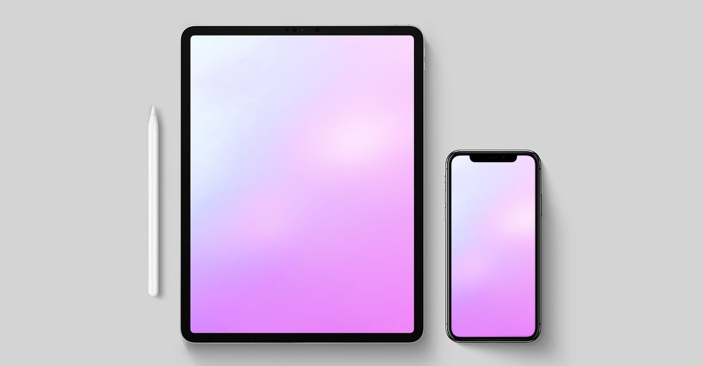

# Obsolescence: Why Devices Don’t Last Forever

"Obsolescence" means that something is no longer useful or has become old. With digital devices, obsolescence can happen because:

- **New Technology**: Companies create new devices with more features, so old devices seem slow or out of date. For example, an old phone may not have the same apps or camera quality as a new phone.

- **Planned Obsolescence**: Some companies design devices to last only a few years, so people buy new ones. For example, a phone battery may not last as long after two years. This leads to more e-waste and more resources used to make new devices.

We can reduce obsolescence by taking care of our devices and using them as long as possible.

