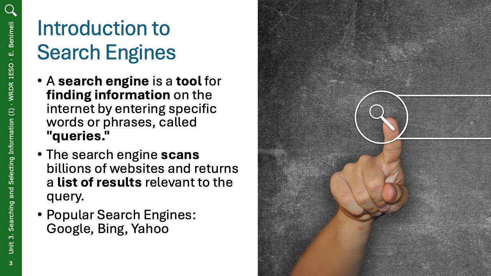
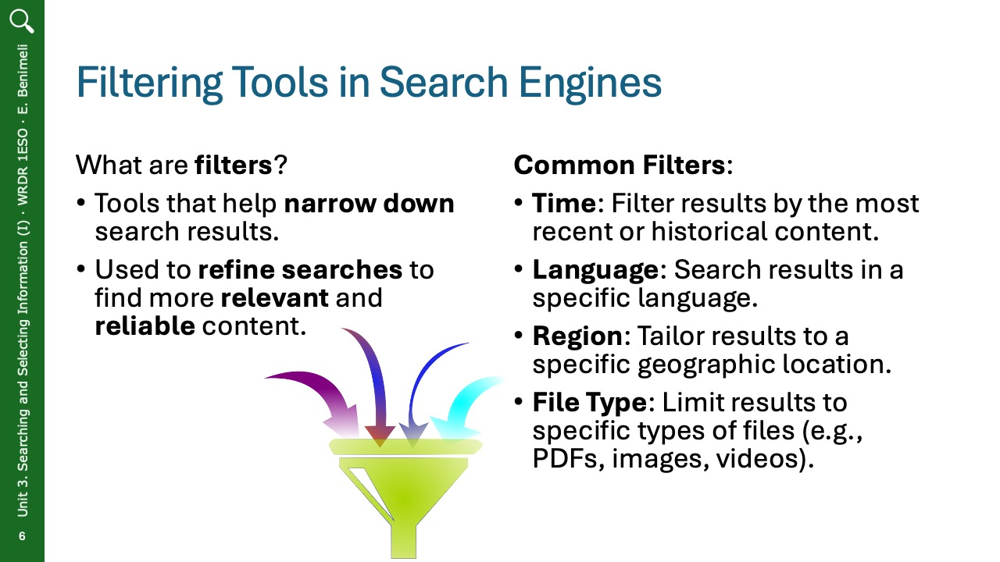
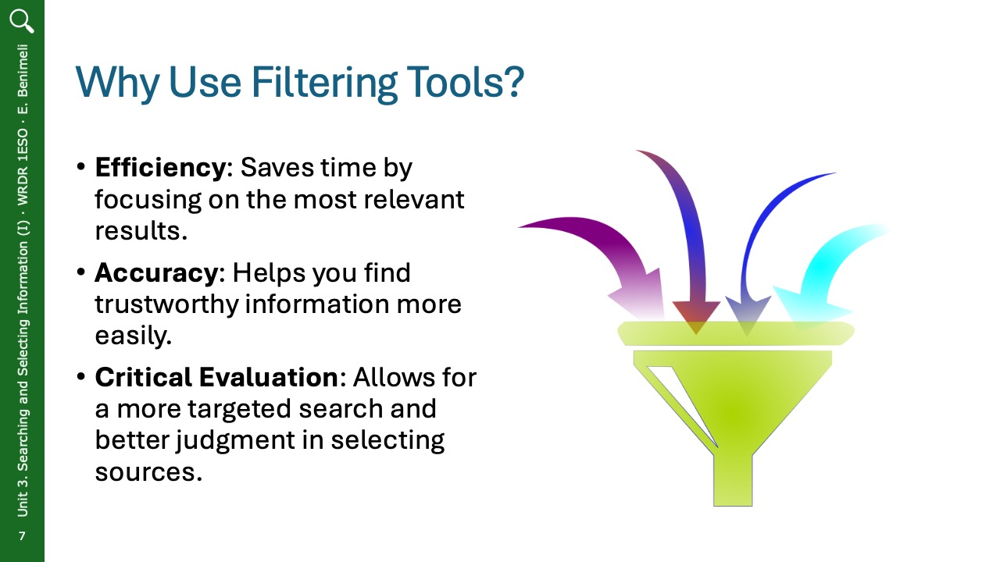
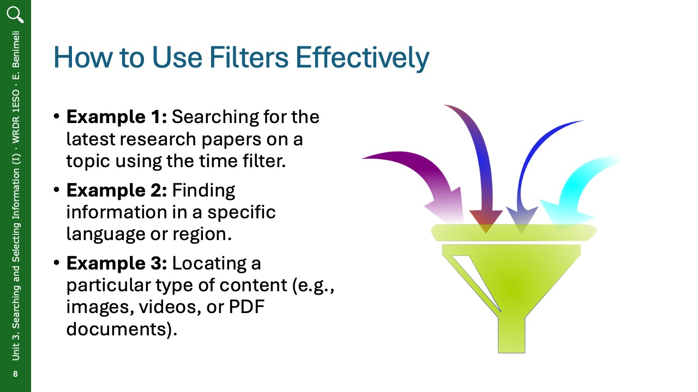

# 1. Types of Web Search Engines and Their Filtering Tools

## Summary

In today’s digital world, search engines are essential tools for finding information online. Whether you're looking for websites, articles, images, or videos, search engines are the quickest way to locate relevant content. Understanding how search engines work and how to use them effectively is crucial for efficiently searching and selecting reliable information.

A search engine is a tool that helps you search for information on the internet by typing in specific words or phrases known as a "query." The search engine then scans billions of websites and returns a list of results that are most relevant to your search. Popular search engines include Google, Bing, and Yahoo. These search engines organize vast amounts of online content and help you find what you're looking for with just a few clicks.

Learn about the major components of a Google search engine results page.

<iframe width="560" height="315" src="https://www.youtube.com/embed/86YTKhQDIn0?si=JNAxjwcUGR3uMkhv" title="YouTube video player" frameborder="0" allow="accelerometer; autoplay; clipboard-write; encrypted-media; gyroscope; picture-in-picture; web-share" referrerpolicy="strict-origin-when-cross-origin" allowfullscreen></iframe>

 

Search engines are powerful tools for navigating the internet and finding relevant information. However, due to the vast amount of content online, it’s essential to use filtering tools to narrow down results and find the most useful and trustworthy information. Filters like time, language, region, and file type help you refine your search, save time, and focus on what matters most. By using these tools effectively, you can improve your ability to select reliable information and enhance your research skills. Filtering tools not only make searching more efficient but also enable you to critically evaluate and access relevant content with ease.

## Slides

  
    
  </a>
  
  
  
  
  
  
  

 
