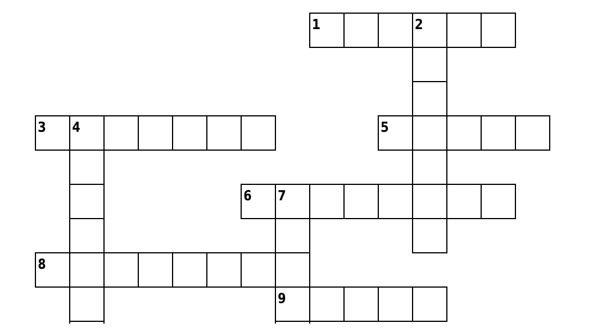

# Search Engines: Types of Web Search Engines

[⬇ PDF notes](s31_searchengines_ex.pdf)

**Name**: 

<!-- Find the following hidden words in the word search: **SEARCH, DATABASE, QUERY, CRAWLING, INDEX, RANKING, ALGORITHM, RESULT, CONTENT, WEBSITE**
-->

## Exercise 1: Crossword Puzzle

Solve this crossword puzzle using key terms related to search engines. Each clue describes a concept involved in searching for information online. Test your knowledge of how search engines organize and retrieve data!

**ACROSS**

* (1). A process of looking for information online by typing keywords or phrases in a tool.
* (3). The order in which search results are displayed based on relevance, authority, and content quality.
* (5). A word or phrase entered into a search engine to find relevant online information.
* (6). A collection of web pages with information accessible via the internet, indexed by search engines.
* (8). The process where automated programs visit websites to collect data by following links between pages.
* (9). A database where collected website data is stored, enabling quick retrieval during searches.
* (10). The text, images, videos, or other media found on websites that are indexed by search engines

**DOWN**

* (2). The list of web pages, images, or videos shown after entering a search query.
* (4). A set of instructions used by search engines to process data and determine the relevance of results.
* (7). A tool designed to search the internet and organize relevant results from various websites.

## Exercises 3: Questions

### 1. Search Engines

**How do search engines help you find information on the internet?**

    

<!--
**Answer:** Search engines help you find information by scanning millions of websites and returning a list of results based on specific words or phrases (queries) you type. They organize content to make it easier to find relevant information quickly.
-->
---

### Web Crawlers

**2. What is the role of web crawlers in search engines?**

    

<!--
**Answer:** Web crawlers are automated programs that visit websites and collect data, such as text, images, and videos. They follow links between pages to gather information, which helps search engines create a database of indexed content for later searches.
-->
---

### Evaluation of search engine results

**3. Why is it important to critically evaluate search engine results?**

    

<!--**Answer:** It’s important because not all search results are accurate or trustworthy. Although search engines rank results, the first results may not always be the best. You should always check the quality and reliability of the information you find.
-->
---

## Exercise 3: Quiz

### 1. What is the main purpose of a search engine?
A. To store information online  
B. To help you search for relevant information  
C. To organize your personal files  
D. To display websites without sorting them  

---

### 2. How do search engines rank results?
A. Based on the number of visitors to a website  
B. Using an algorithm that considers relevance, authority, and content quality  
C. By the amount of advertisements on the website  
D. According to the website’s design  

---

### 3. What is the role of web crawlers in search engines?
A. To filter irrelevant content from the results  
B. To visit websites and gather data about their content  
C. To display results in the search engine  
D. To create new websites automatically  

---

### 4. Which of the following is NOT a popular search engine mentioned in the text?
A. Google  
B. Bing  
C. Yahoo  
D. Firefox  

---

### 5. What does the term "indexing" refer to in the context of search engines?
A. Storing and organizing website data collected by crawlers  
B. Displaying search results on a webpage  
C. The process of typing in a query  
D. Ranking websites based on the number of clicks  

