# 2. Selecting and Verifying Information in Digital Media

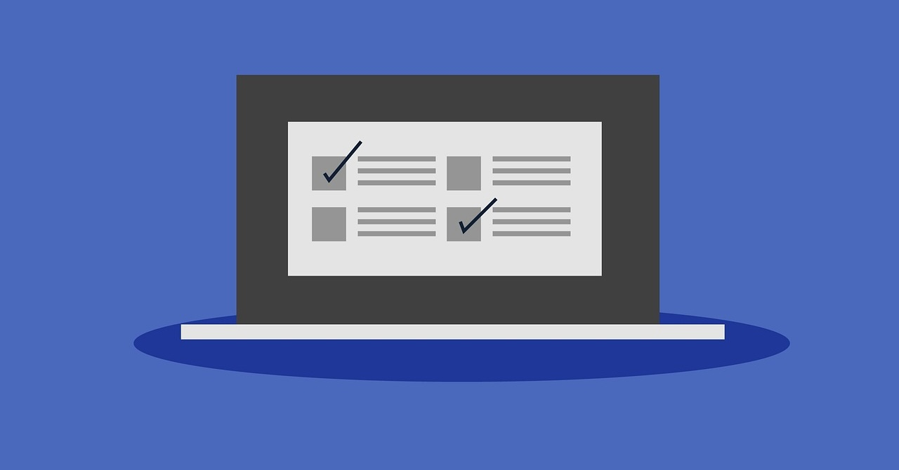

## Introduction

The internet is full of information, but not all of it is true. Some websites share incorrect or misleading information. This is why it is important to check if what you find online is accurate. Learning how to verify information helps you make good decisions and avoid spreading false content.

  <a href="slides/unit3-2/Diapositiva1.jpeg" class="glightbox">
    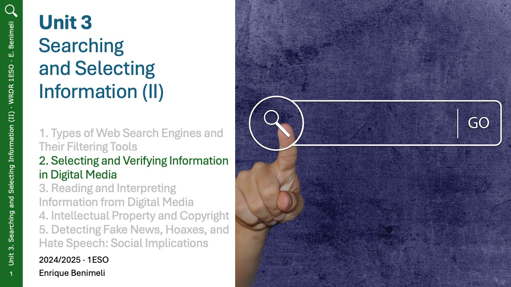
  </a>
    <a href="slides/unit3-2/Diapositiva2.jpeg" class="glightbox hidden">
    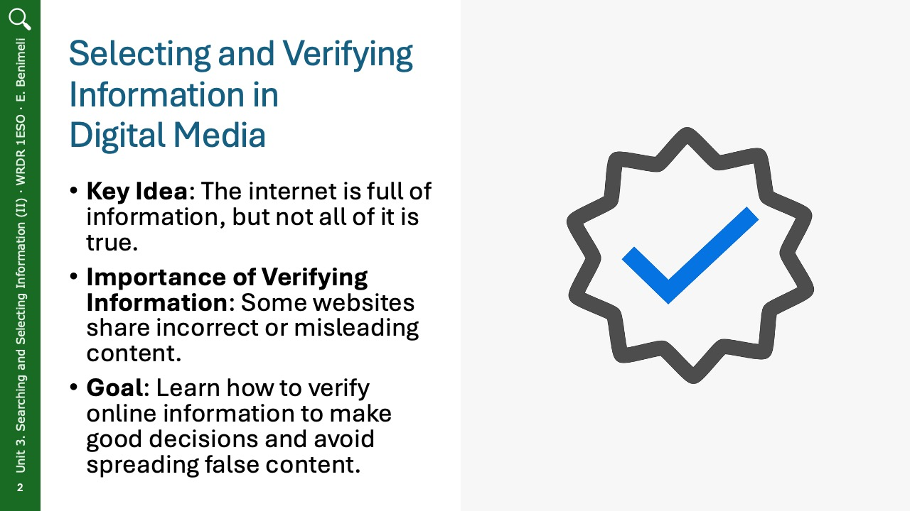
  </a>
  </a>
  <a href="slides/unit3-2/Diapositiva3.jpeg" class="glightbox hidden">
    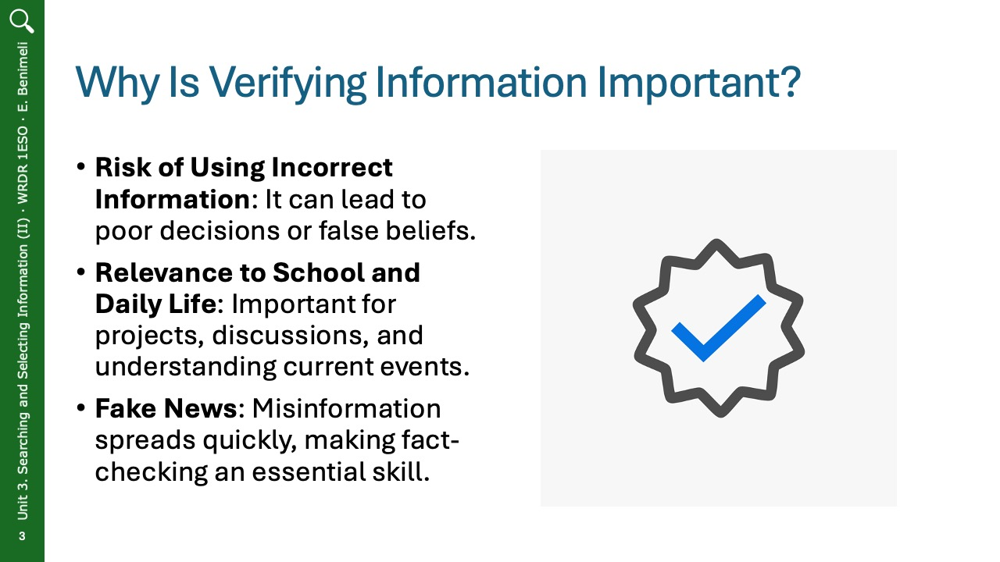
  </a>
  <a href="slides/unit3-2/Diapositiva4.jpeg" class="glightbox hidden">
    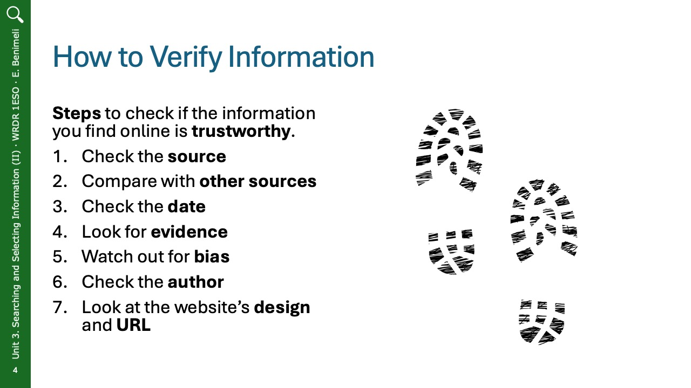
  </a>
  <a href="slides/unit3-2/Diapositiva5.jpeg" class="glightbox hidden">
    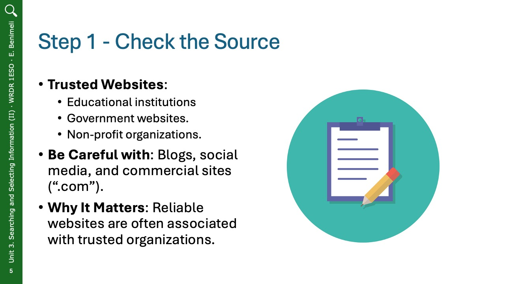
  </a>
  <a href="slides/unit3-2/Diapositiva6.jpeg" class="glightbox hidden">
    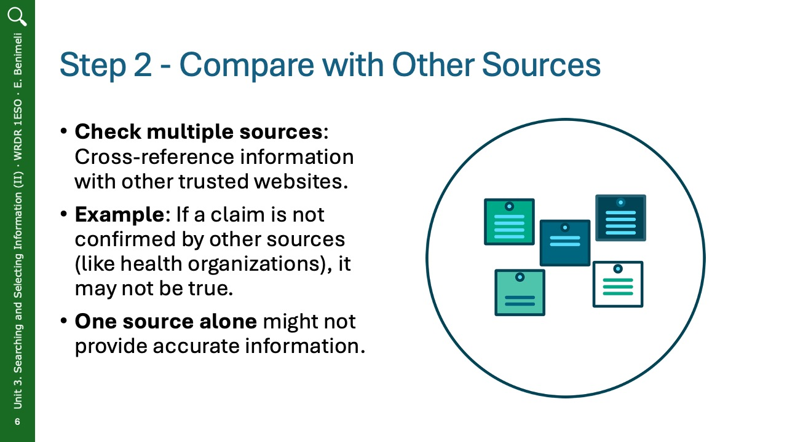
  </a>
  <a href="slides/unit3-2/Diapositiva7.jpeg" class="glightbox hidden">
    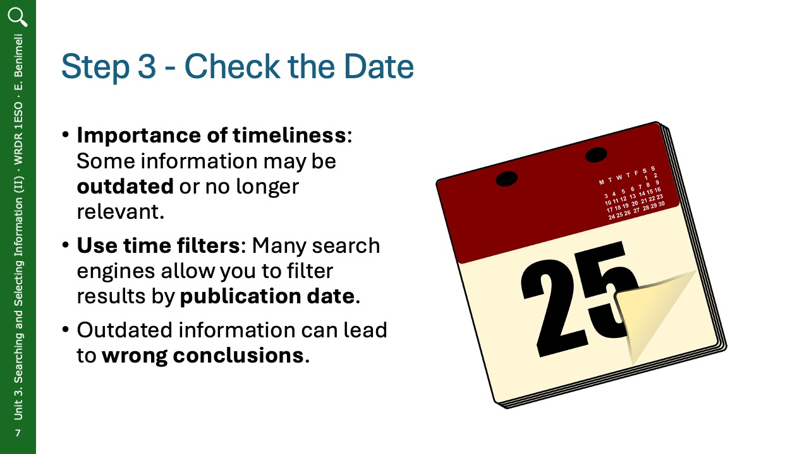
  </a>
  <a href="slides/unit3-2/Diapositiva8.jpeg" class="glightbox hidden">
    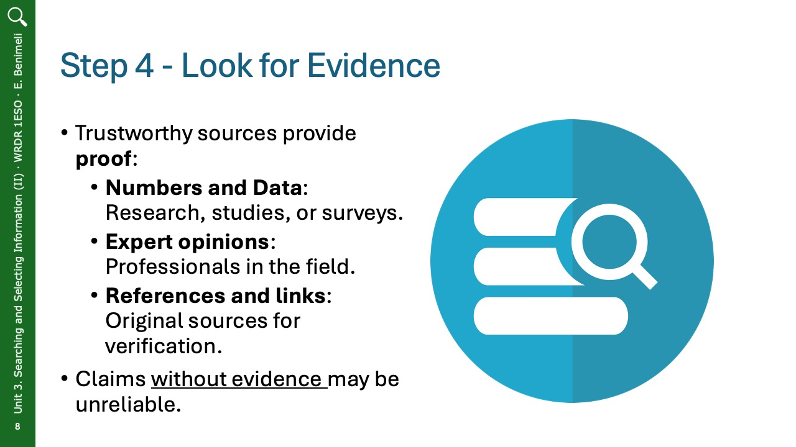
  </a>
  <a href="slides/unit3-2/Diapositiva9.jpeg" class="glightbox hidden">
    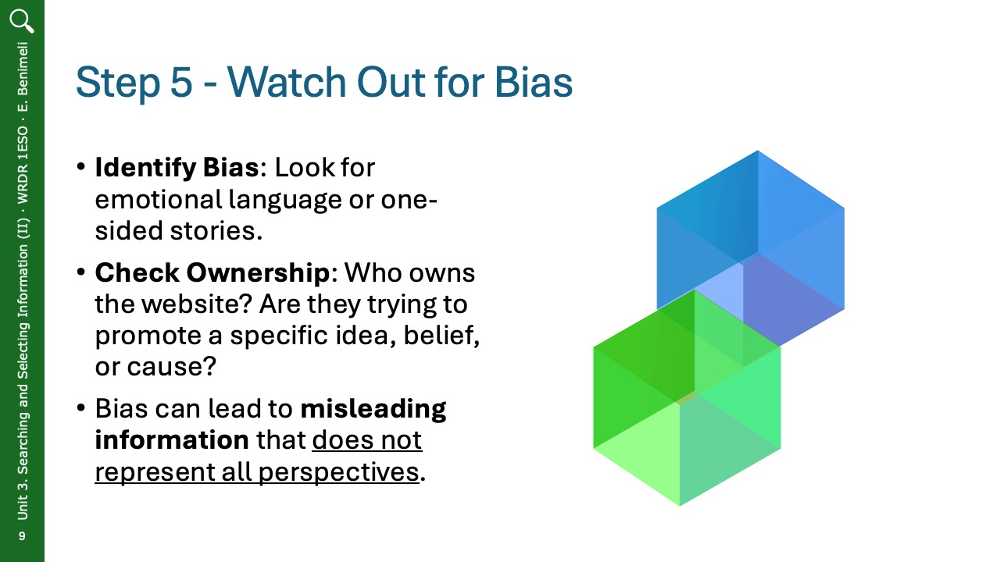
  </a>
  <a href="slides/unit3-2/Diapositiva10.jpeg" class="glightbox hidden">
    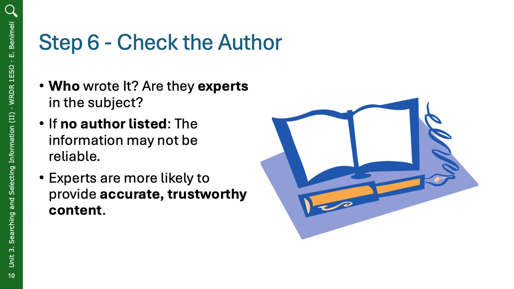
  </a>
    <a href="slides/unit3-2/Diapositiva11.jpeg" class="glightbox hidden">
    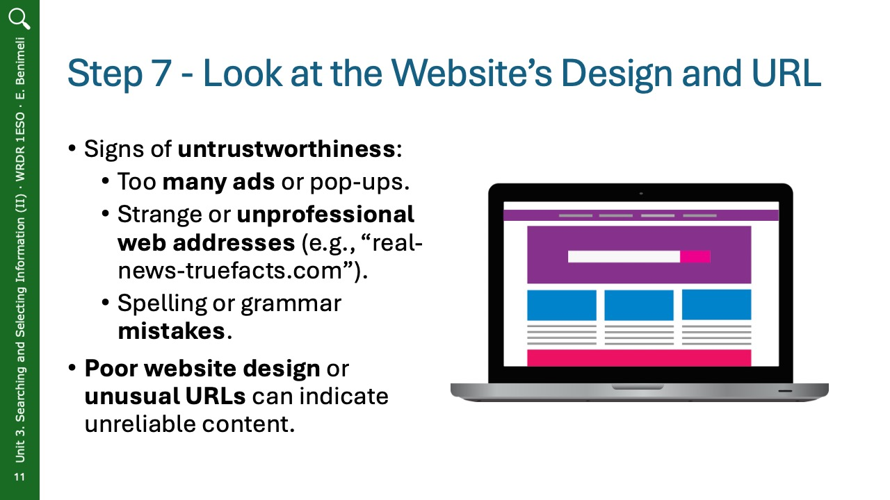
  </a>
    <a href="slides/unit3-2/Diapositiva12.jpeg" class="glightbox hidden">
    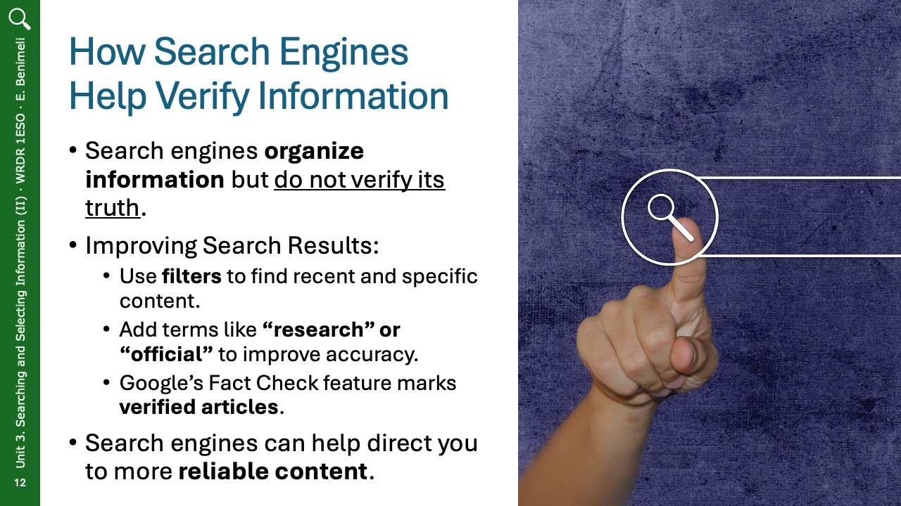
  </a>
    <a href="slides/unit3-2/Diapositiva13.jpeg" class="glightbox hidden">
    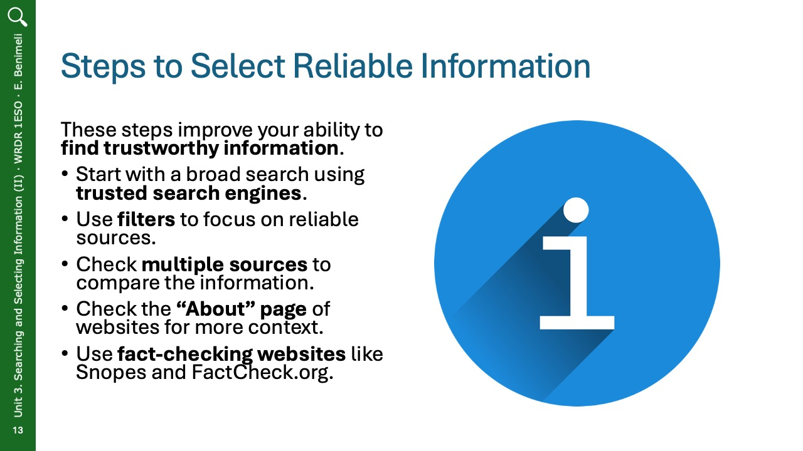
  </a>
    <a href="slides/unit3-2/Diapositiva14.jpeg" class="glightbox hidden">
    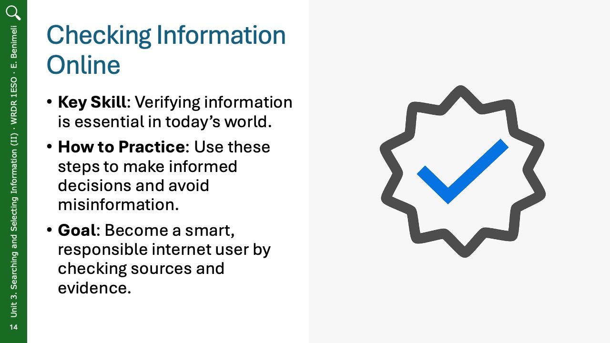
  </a>

 

## Why Is Verifying Information Important?

If you use incorrect information, you might make bad decisions or believe things that are not true. This can be a problem, especially when working on school projects or discussing important topics. Fake news and misinformation spread quickly, so knowing how to check facts is an important skill.

## How to Verify Information

There are simple steps you can follow to check if online information is trustworthy:

### 1. **Check the Source**

Some websites are more reliable than others. Trusted websites often belong to schools, governments, or well-known organizations. Look for:

- Educational websites (e.g., universities and schools).
- Government websites with official information.
- Non-profit organizations that often provide factual content.

Be careful with blogs, social media, and commercial sites (**“.com”**) because they might share opinions or false information.

### 2. **Compare with Other Sources**

Do not trust just one website. Check if other trusted sources say the same thing. If only one site claims something, it might not be true.

For example, if you read that drinking a special juice cures all diseases, check medical websites like the World Health Organization (WHO) or a national health agency. If they do not confirm it, the information is probably false.

### 3. **Check the Date**

Some information changes over time. Always look at when the article or website was published. Older articles might not be relevant anymore.

If you are looking for news, check the date to ensure it is recent. Many search engines allow you to filter results by time to find the most up-to-date content.

### 4. **Look for Evidence**

Reliable sources provide proof to support their claims. Look for:

- **Numbers and data** from research or studies.
- **Expert opinions** from professionals in the field.
- **References and links** to original sources.

If an article does not provide proof or sources, it might not be trustworthy.

### 5. **Watch Out for Bias**
Some websites share only one side of a story. They may use emotional language to make you believe something. To check for bias:

- Find out who owns the website. Some companies or groups try to convince people to support their ideas.
- Read different sources to see different perspectives.
- Avoid websites that use extreme language or exaggerated claims.

### 6. **Check the Author**

See who wrote the article. Are they experts? Have they written other reliable content? If there is no author, the information may not be trustworthy.

### 7. **Look at the Website’s Design and URL**

Untrustworthy websites often look unprofessional. Be cautious if a website:

- Has too many advertisements or pop-ups.
- Uses a strange web address (e.g., **“real-news-truefacts.com”** instead of a well-known news site like **bbc.com**).
- Contains many spelling and grammar mistakes.

### How to Fact-Check Online Sources

<iframe width="560" height="315" src="https://www.youtube.com/embed/Kim9ujIU874?si=Cz0MP6Yon-X7bPsZ" title="YouTube video player" frameborder="0" allow="accelerometer; autoplay; clipboard-write; encrypted-media; gyroscope; picture-in-picture; web-share" referrerpolicy="strict-origin-when-cross-origin" allowfullscreen></iframe>

 

## How Search Engines Help Verify Information

Search engines like Google and Bing help find information, but they do not decide what is true. They organize results based on popularity and keywords. To get better search results:

- Use filters to find recent and specific information.
- Add words like “research” or “official” to your search.
- Check Google’s **Fact Check** feature, which labels some verified articles.

## Steps to Select Reliable Information

To use these skills in daily life, follow these steps:

1. **Start with a broad search** – Use reliable search engines.
2. **Use filters** – Choose results based on date and source type.
3. **Open multiple sources** – Compare at least three websites before deciding what is true.
4. **Check the “About” page** – See who runs the website and why they share the information.
5. **Use fact-checking websites** – Websites like Snopes and FactCheck.org help verify news stories.

## Checking information online

Being able to check information online is a key skill in today’s world. By verifying sources, comparing facts, and looking for reliable evidence, you can avoid misinformation and make informed decisions. Practicing these steps will help you become a smart and responsible internet user.

