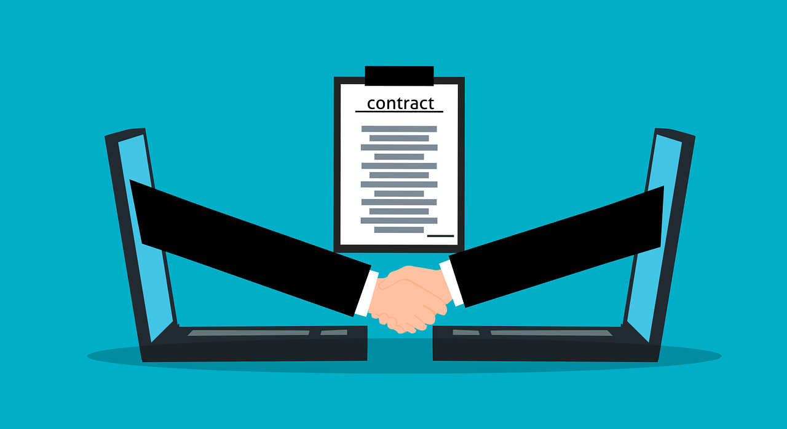

# 4. Intellectual Property and Copyright

When using information from digital media, it’s important to respect intellectual property rights. Intellectual property refers to creations of the mind such as inventions, artistic works, and written content. These creations belong to their authors, just like your homework belongs to you after you complete it. Copyright is the law that protects these creations from being copied, shared, or used without permission.

## What is Copyright?
Copyright is a legal right that gives the creator of an original work exclusive control over how their work is used and shared. This means that if someone writes a book, takes a photo, composes a song, or creates a video, they have the right to decide who can use it and how. Other people cannot copy, distribute, or change these works without permission. Copyright applies to various types of content, including:

- Books, articles, and other written materials
- Paintings, photographs, and other visual art
- Songs, recordings, and musical compositions
- Movies, TV shows, and animations
- Software and video games

Some exceptions allow people to use copyrighted materials in specific cases, such as for education, news reporting, or criticism. However, it’s important to be aware of the rules to avoid violating copyright laws.

## Why is Copyright Important?

Copyright is important because it protects the rights of creators and encourages them to continue producing new ideas and content. Imagine if you spent hours drawing a picture, but someone else took it, claimed it was theirs, and even made money from it. That would be unfair! Copyright ensures that creators:

- Get credit for their work
- Can earn money from their creations
- Control how their work is used
- Prevent others from using their work without permission

Respecting copyright also helps students like you avoid plagiarism and legal problems. Using someone else's work without permission can result in serious consequences, such as removal of content, fines, or legal action.

## How to Use Information Legally

When researching or using content online, there are safe and legal ways to do so while respecting copyright laws. Here are some key guidelines:

1. **Look for Creative Commons Licenses**
   Some creators allow their work to be used under specific conditions through Creative Commons (CC) licenses. These licenses indicate what you can and cannot do with the content. Some CC licenses allow you to use, share, or modify content for free, while others may require you to give credit or not use it for commercial purposes.

2. **Cite Your Sources**
   If you use information, images, or ideas from someone else’s work, always give credit to the original creator. This is called citing your sources. It shows respect for the creator’s work and helps you avoid plagiarism. Citing sources usually includes mentioning the author’s name, the title of the work, and the source where you found it.

3. **Use Public Domain Content**
   Some works are in the public domain, which means they are no longer protected by copyright and can be used freely. These include very old books, classical music, and historical artworks. However, it’s always good to check whether a work is truly in the public domain before using it.

4. **Understand Fair Use**
   In some cases, copyrighted content can be used without permission under the principle of "fair use." This applies mainly to educational purposes, reviews, research, or parody. However, fair use has limits, and using large portions of someone’s work or for commercial gain is not allowed.

### How to Find Legal Content to Use

If you need images, music, or articles for a project, consider using sources that provide legal and free-to-use content. Some popular websites for finding legal content include:

- **Pixabay, Unsplash, and Pexels** (for free images and photos)
- **Free Music Archive and YouTube Audio Library** (for free music and sound effects)
- **Project Gutenberg** (for books in the public domain)
- **Wikipedia and Open Educational Resources** (for educational content)

### What Happens if You Break Copyright Laws?

If you use copyrighted material without permission, there can be consequences. Depending on the situation, these could include:

- **Content Removal**: Websites or platforms may delete content that violates copyright laws.
- **Legal Consequences**: The creator may take legal action against those who use their work illegally, sometimes resulting in fines.
- **Academic Penalties**: Schools may consider using copyrighted work without permission as plagiarism, which can lead to disciplinary actions, such as lower grades or academic warnings.

## Conclusion

Understanding intellectual property and copyright is essential when using digital media. By respecting copyright laws, citing sources, and using Creative Commons or public domain content, you can ensure that you are using information legally and ethically. This not only helps protect creators but also teaches you responsible and respectful digital habits that you will use throughout your life. Always remember: if you didn’t create it, check if you have the right to use it!