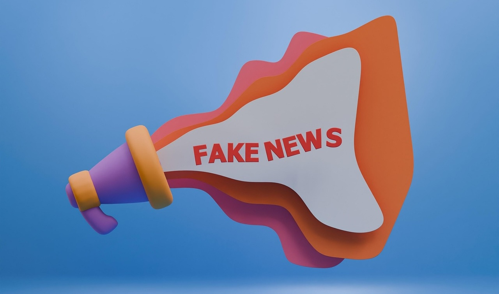

# Fake News and Hoaxes

## What is Fake News?

Fake news refers to false or misleading information presented as if it were true news. This information can be created for various reasons. Sometimes, people make fake news to trick others, while other times it is used to promote a particular belief or agenda. Fake news often sounds dramatic, surprising, or sensational—designed to grab attention. Because it appeals to emotions and curiosity, people may share it quickly without checking if it is true.

Fake news can take many forms. Some of the most common are:

- **Completely made-up stories**: These may look like news articles but have no basis in reality.
- **Misleading headlines**: Sometimes, an article might contain true information, but the headline is designed to mislead readers or exaggerate facts.
- **Distorted facts**: Some articles may mix real information with false details, leading to a biased or incorrect conclusion.

## How to Detect Fake News

It’s important to be cautious when reading news online. Here are some strategies to help you detect fake news:

1. **Check the Source**  
   The source of the information is one of the most important things to consider. Trusted news outlets like BBC, Reuters, and major newspapers are more likely to provide accurate and fact-checked information. On the other hand, websites with unfamiliar names, strange URLs, or websites that you have never heard of should raise a red flag. Some websites are specifically created to spread false information or promote certain views. Always check who is behind the website and whether it is reputable.

2. **Look for Evidence**  
   Fake news often lacks supporting evidence. If an article makes bold claims or tells you that something shocking is happening, check to see if it includes links, quotes, or data from experts. Reliable news articles will always provide sources, such as interviews with experts or studies from trusted organizations, to back up their information. If the article does not provide any supporting evidence or cites unreliable sources, it’s probably not trustworthy.

3. **Beware of Emotional Language**  
   Fake news often uses strong emotional language to stir up feelings like anger, fear, or excitement. For example, you might see headlines like, "The world is ending!" or "Danger is coming!" These types of headlines are meant to make you feel emotional and share the story without questioning it. If an article seems designed to make you feel strongly about something without offering facts or evidence, it could be fake.

4. **Cross-Check with Other Sources**  
   A good way to verify information is by checking multiple sources. If a news story is true, it is likely that other reliable sources will report on it as well. Look for similar articles from trusted websites to see if they report the same facts.

## How Fake News Spreads

<iframe width="560" height="315" src="https://www.youtube.com/embed/cSKGa_7XJkg?si=uZShYTe7ceghw9Bq" title="YouTube video player" frameborder="0" allow="accelerometer; autoplay; clipboard-write; encrypted-media; gyroscope; picture-in-picture; web-share" referrerpolicy="strict-origin-when-cross-origin" allowfullscreen></iframe>

---