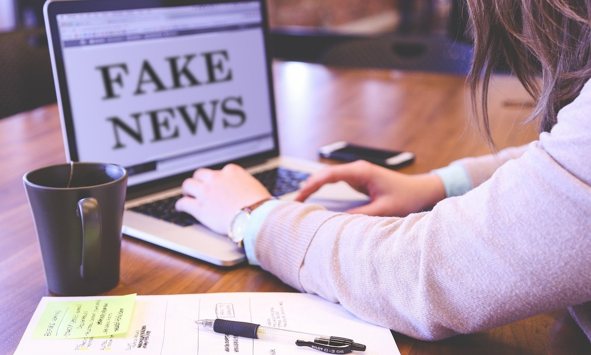

# Social Implications of Fake News and Hate Speech

## Misinformation, Division, and Influence

Both fake news and hate speech can have serious consequences for society. These types of harmful content can spread quickly, especially on social media, where people often share information without checking its truthfulness. The social implications are far-reaching and can lead to:

- **Misinformation and Public Confusion**  
   Fake news can confuse the public and make it harder for people to know what is true. This can lead to poor decision-making, misunderstandings, and fear. For example, fake news about a health issue or political event can cause panic or influence public opinion in the wrong direction.

- **Dividing Society**  
   Hate speech can tear communities apart by creating anger and fear. It can lead to social tension, where different groups distrust or even hate each other. This can damage relationships and make it difficult for people to live peacefully together. If hate speech is left unchecked, it can lead to violence, discrimination, or even crimes against certain groups of people.

- **Influencing Elections and Political Opinions**  
   Fake news and hate speech can also influence elections. By spreading lies, exaggerations, or harmful messages, fake news can manipulate voters. Similarly, hate speech can change people’s views on certain candidates or political issues, often based on fear or prejudice rather than facts.

## Being a Responsible Consumer of Information

To prevent the harmful effects of fake news and hate speech, it’s important to become a responsible consumer of information.

Being a <b>responsible consumer of information</b> means checking sources, verifying facts, and thinking critically about the information you read online.

Additionally, we should be mindful of what we share with others. Before passing on any information, ask yourself if it is reliable, if it respects others, and if it could cause harm to individuals or communities.

By learning to spot fake news, hoaxes, and hate speech, we can help create a more informed, respectful, and peaceful online world.