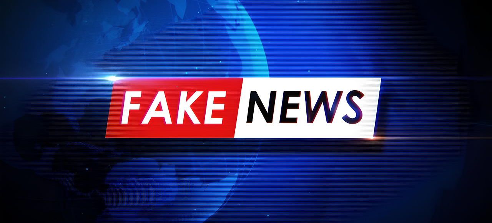

# 5. Detecting Fake News, Hoaxes, and Hate Speech: Social Implications

In today’s world, the internet is filled with information. While this can be very useful, it also means there is a lot of false, harmful, or misleading content online. Fake news, hoaxes, and hate speech are some of the most serious issues that we face. These types of content can spread quickly and cause harm to individuals and communities. It is important to learn how to spot them, how they affect society, and how we can protect ourselves and others from their negative consequences.

## What is Fake News?

Fake news refers to false or misleading information presented as if it were true news. This information can be created for various reasons. Sometimes, people make fake news to trick others, while other times it is used to promote a particular belief or agenda. Fake news often sounds dramatic, surprising, or sensational—designed to grab attention. Because it appeals to emotions and curiosity, people may share it quickly without checking if it is true.

Fake news can take many forms. Some of the most common are:

- **Completely made-up stories**: These may look like news articles but have no basis in reality.
- **Misleading headlines**: Sometimes, an article might contain true information, but the headline is designed to mislead readers or exaggerate facts.
- **Distorted facts**: Some articles may mix real information with false details, leading to a biased or incorrect conclusion.

## How to Detect Fake News

It’s important to be cautious when reading news online. Here are some strategies to help you detect fake news:

1. **Check the Source**  
   The source of the information is one of the most important things to consider. Trusted news outlets like BBC, Reuters, and major newspapers are more likely to provide accurate and fact-checked information. On the other hand, websites with unfamiliar names, strange URLs, or websites that you have never heard of should raise a red flag. Some websites are specifically created to spread false information or promote certain views. Always check who is behind the website and whether it is reputable.

2. **Look for Evidence**  
   Fake news often lacks supporting evidence. If an article makes bold claims or tells you that something shocking is happening, check to see if it includes links, quotes, or data from experts. Reliable news articles will always provide sources, such as interviews with experts or studies from trusted organizations, to back up their information. If the article does not provide any supporting evidence or cites unreliable sources, it’s probably not trustworthy.

3. **Beware of Emotional Language**  
   Fake news often uses strong emotional language to stir up feelings like anger, fear, or excitement. For example, you might see headlines like, "The world is ending!" or "Danger is coming!" These types of headlines are meant to make you feel emotional and share the story without questioning it. If an article seems designed to make you feel strongly about something without offering facts or evidence, it could be fake.

4. **Cross-Check with Other Sources**  
   A good way to verify information is by checking multiple sources. If a news story is true, it is likely that other reliable sources will report on it as well. Look for similar articles from trusted websites to see if they report the same facts.

## What is Hate Speech?

Hate speech refers to any kind of speech or communication that attacks, discriminates, or incites violence against individuals or groups based on their race, religion, ethnicity, gender, sexual orientation, or other personal characteristics. Hate speech is harmful and can cause a lot of damage to people and communities. It can create division, spread fear, and lead to violence.

While freedom of speech is important, hate speech crosses the line by promoting intolerance and harm. It can affect not only the people being targeted but also the larger society by creating a hostile environment. Sometimes, hate speech can even lead to real-world actions, like discrimination, bullying, or violent protests.

## How to Detect Hate Speech

Here are some common signs of hate speech:

1. **Look for Discriminatory Language**  
   Hate speech often includes slurs or negative terms aimed at a particular group of people. If the language used in a post or article is disrespectful or hateful towards a group because of their race, religion, gender, or other characteristics, it’s likely to be hate speech.

2. **Encouragement of Violence or Hatred**  
   Another clear sign of hate speech is if it encourages people to hurt others, whether physically or emotionally. For example, it may promote violence, discrimination, or hostility against a specific group. If a post or article urges people to harm others or treat them unfairly, this is a dangerous form of hate speech.

3. **Spreading Division**  
   Hate speech often aims to create division between groups of people. It encourages “us vs. them” thinking and paints certain groups of people as enemies or threats. If content makes people feel that they must oppose or hate others, it’s likely harmful.

## Social Implications of Fake News and Hate Speech

Both fake news and hate speech can have serious consequences for society. These types of harmful content can spread quickly, especially on social media, where people often share information without checking its truthfulness. The social implications are far-reaching and can lead to:

- **Misinformation and Public Confusion**  
   Fake news can confuse the public and make it harder for people to know what is true. This can lead to poor decision-making, misunderstandings, and fear. For example, fake news about a health issue or political event can cause panic or influence public opinion in the wrong direction.

- **Dividing Society**  
   Hate speech can tear communities apart by creating anger and fear. It can lead to social tension, where different groups distrust or even hate each other. This can damage relationships and make it difficult for people to live peacefully together. If hate speech is left unchecked, it can lead to violence, discrimination, or even crimes against certain groups of people.

- **Influencing Elections and Political Opinions**  
   Fake news and hate speech can also influence elections. By spreading lies, exaggerations, or harmful messages, fake news can manipulate voters. Similarly, hate speech can change people’s views on certain candidates or political issues, often based on fear or prejudice rather than facts.

## Being a Responsible Consumer of Information

To prevent the harmful effects of fake news and hate speech, it’s important to become a responsible consumer of information. This means checking sources, verifying facts, and thinking critically about the information you read online. Additionally, we should be mindful of what we share with others. Before passing on any information, ask yourself if it is reliable, if it respects others, and if it could cause harm to individuals or communities.

By learning to spot fake news, hoaxes, and hate speech, we can help create a more informed, respectful, and peaceful online world.