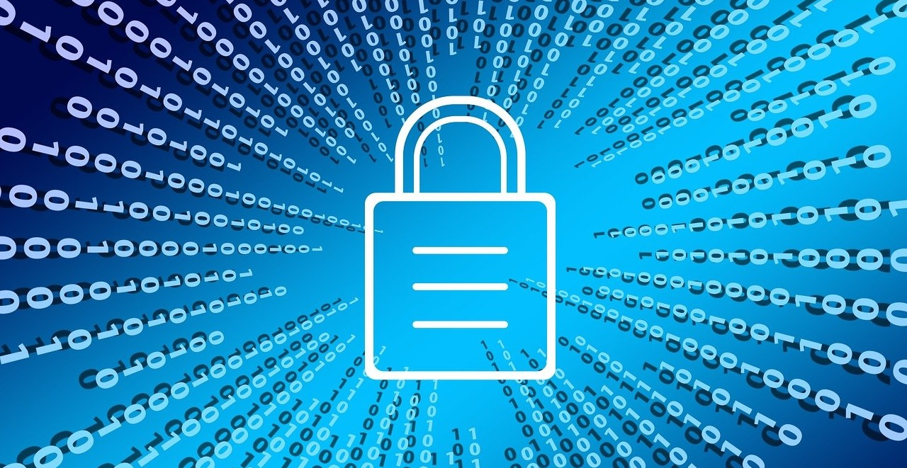

# Online Security and Privacy

## Summary

Staying safe and responsible online requires smart habits.

* First, **think before you share**—your posts can be permanent and affect your **reputation**. Be mindful of who can see your content, as it can impact opportunities like jobs or college.
* Second, **protect your stuff** by using **strong passwords** with a mix of letters, numbers, and symbols. Never share passwords except with a trusted adult, and always log out from **public** computers.
* Third, **know and use your settings** to keep personal **information** private. Adjust **security settings** on each platform to control who sees your **posts**.
* Fourth, **avoid scams** like phishing attempts that trick you into giving away **passwords** or personal details. Be **suspicious** of offers that seem too good to be true.
* Lastly, **be positive**—encourage kindness online, report negativity, and use the **internet** to make a difference.

By following these tips, you can create a **safe**, responsible, and enjoyable online experience.

## Tip 1: Think Before You Share

<iframe width="560" height="315" src="https://www.youtube.com/embed/BcdZm3WAF4A?si=5UshQoLQHjsYrIaa" title="YouTube video player" frameborder="0" allow="accelerometer; autoplay; clipboard-write; encrypted-media; gyroscope; picture-in-picture; web-share" referrerpolicy="strict-origin-when-cross-origin" allowfullscreen></iframe>

---

**Think before you share!** The **web** connects us all and allows us to **share** in ways we have never before been able to. Whether through **social media** posts, comments, or even videos, we can reach friends near and far with just a **click**. But what you share on the web and who you share it with can end up saying a lot about you—and can become a part of your **life story**. You can't control information once it's out there in the world.  

What you post or send can easily be **forwarded**, copied, or found by other **internet users**, including strangers or people you know who aren't necessarily your friends. Other people's impressions of you can change based on what you share. Posting **inappropriate** information can have **negative** consequences you may not have considered. This can impact your place on the soccer team, summer job opportunities, and even one day, what **college** you go to.  

The **internet** is an awesome tool for having fun and making new friends. But with great power comes great responsibility. So use your power for good. You can just as easily lose friends as make them, based on how you manage your **reputation** online.  

So don't forget—to **think before you share**.  

---

## Tip 2: Protect Your Stuff

<iframe width="560" height="315" src="https://www.youtube.com/embed/ue1r_63GkIw?si=T5reyNRtVdWt1New" title="YouTube video player" frameborder="0" allow="accelerometer; autoplay; clipboard-write; encrypted-media; gyroscope; picture-in-picture; web-share" referrerpolicy="strict-origin-when-cross-origin" allowfullscreen></iframe>

---

Most of us have things on the **web** that we want to keep **safe**. One of the best ways to do this is by setting **strong passwords** on all your accounts. By knowing how to create strong passwords, you can further safeguard your **personal information**.  

So, how do you create a really strong password? First, use at least **eight characters**—the longer your password is, the harder it is to guess. Second, mix **letters, numbers, and symbols**. Third, make it different for each site.  

Once we know how to set a strong password, we need to learn how to **remember** it. We recommend picking a favorite book title, sports team, song, or phrase to help you build a strong password. Don't **share** your password unless it's with a parent or trusted adult. Like the key to your house or the combination to your locker, passwords protect things that are valuable to you and shouldn't be shared.  

Protecting your **information** online also means logging out of websites, programs, and applications when you're using a **public** or shared computer. If you don’t log out, someone else could access your accounts and personal information.  

So always remember to **protect** your stuff.  

---

## Tip 3: Know and Use Your Settings

<iframe width="560" height="315" src="https://www.youtube.com/embed/ALJk5416mNM?si=6kQcSH0jCIYY7R3t" title="YouTube video player" frameborder="0" allow="accelerometer; autoplay; clipboard-write; encrypted-media; gyroscope; picture-in-picture; web-share" referrerpolicy="strict-origin-when-cross-origin" allowfullscreen></iframe>

---

Why do you need to understand **settings**? Because not all **information** people post online is meant to be seen by absolutely everyone. Some information should be kept **private** or shared with a smaller audience.  

Just like in the real world, you share different things with different people. You can share some **pictures** with family and friends, but think carefully about what you share with everyone else. **Security settings** can help you control who can see your **posts**, making it easier to keep your information **safe**.  

Most sites will have **settings** buttons where you can easily find them. However, remember that they can be in different places on each site you use. The wrong **settings** can expose your **personal** details to more people than you intended.  

So always remember—to **know and use your settings**.  

---

## Tip 4: Avoid Scams

<iframe width="560" height="315" src="https://www.youtube.com/embed/BX3y_an89PQ?si=uJO8t7t04Qnb3oMm" title="YouTube video player" frameborder="0" allow="accelerometer; autoplay; clipboard-write; encrypted-media; gyroscope; picture-in-picture; web-share" referrerpolicy="strict-origin-when-cross-origin" allowfullscreen></iframe>

---

Everyone knows you should never take **candy** from a **stranger**, right? The same principle applies **online**. If someone offers you candy, new **shoes**, a **tablet**, or tells you that you won a **trip** to Hawaii, you should be **suspicious**.

This might seem harmless, but these could be very dangerous ways to lure you in and steal your **passwords** or even your **identity**. This is known as **phishing**. Phishing is the act of attempting to acquire **information** such as usernames, passwords, and personal details by pretending to be a **trustworthy** source.  

By knowing how to identify a **phishing scam**, you can protect yourself and your **personal** information. When in doubt, ask a **parent**, teacher, or trusted adult. So be **aware**, and avoid scams.  

---

## Tip 5: Be Positive

<iframe width="560" height="315" src="https://www.youtube.com/embed/5XXlDS7TtwY?si=LyiLvCjCAoxLYqjp" title="YouTube video player" frameborder="0" allow="accelerometer; autoplay; clipboard-write; encrypted-media; gyroscope; picture-in-picture; web-share" referrerpolicy="strict-origin-when-cross-origin" allowfullscreen></iframe>

---

Being **positive** online is essential. Everyone, including **students**, is responsible for creating a great online **experience**. There are many ways, big and small, to contribute to this every day. A small positive **action** can make a big difference—leave an encouraging **comment** or send someone a thank-you **text**. These gestures are quick and easy, but they can have a lasting **impact** on someone’s day. Plus, when you do something positive, you **inspire** others to do the same.  

However, the opposite is also true. A little **negativity** can spread and turn into something big and harmful online. If you see someone being mean, talk to an **adult** or take charge and **report** it yourself. Only by taking **action** can we create **change** for ourselves and those around us, both online and in the real world. Everyone can be a **leader** and set a good **example** on the internet.  

The **digital** world offers countless **opportunities** to do amazing things. You can use the **web** to explore the world around you, answer important **questions**, and solve big **problems**. The only question is: how are you going to **change** the world?  

So set a good **example**—and be **positive**.  

---
